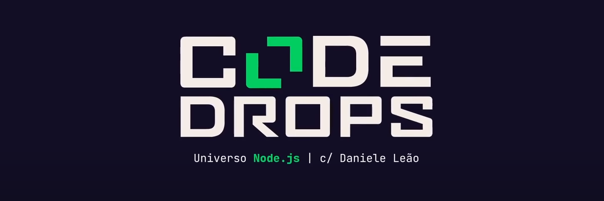
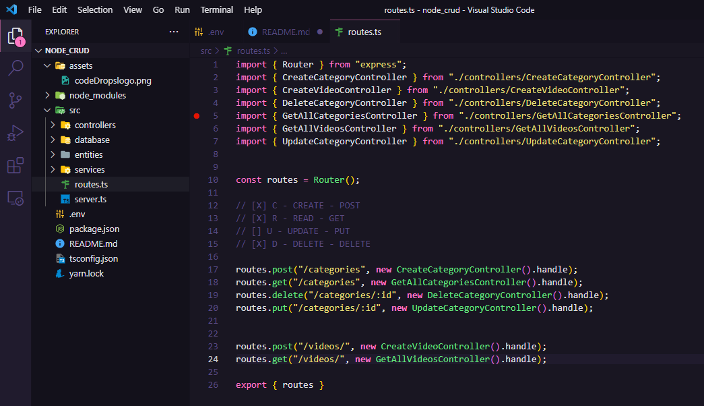

#  CRUD com NODE.JS

<a href="https://www.youtube.com/watch?v=9AO2hZJsHrs" align=center>

##  #code/drops 113
</a>

>  *A Dani Evangelista nos trouxe as 4 operações principais de Banco de Dados (Criar, Ler, Editar e Deletar). Para isso, desenvolvemos uma aplicação Node.Js do zero, integrada ao banco de dados.*

## Tecnologias:
- 
- 
- 

## Ferramentas Utilizadas:

- Postman
- Postgresql 14 e pgAdmin
- Yarn
- VS Code

## Descrição do projeto:
A aplicação consite em um cadastro de filmes por categorias. Podemos criar, alterar, ler e remover dados da aplicação. Vimos um pouco sobre relacionamento entre tabelas utilizando o <a href="https://typeorm.io/#/">TypeOrm</a>. Essas operações são salvas diretamente no nosso banco de dados PostgreSql que já estava pré-configurado.

## Scripts Disponíveis

No diretório do projeto, você pode executar:

### `yarn dev`

Executa o aplicativo no modo de desenvolvimento. \
Abra [http: // localhost: 3000] (http: // localhost: 3000) para acessa-lo na ferramente de requisições de API de sua preferência.

